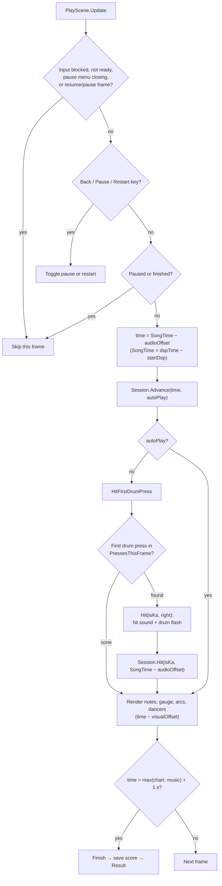
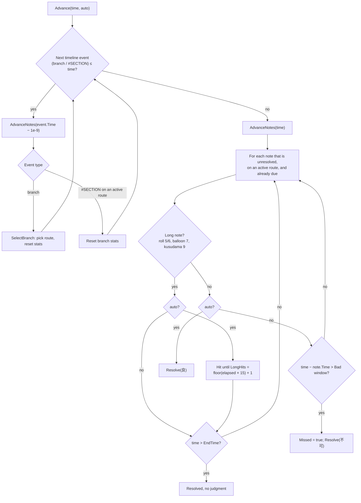
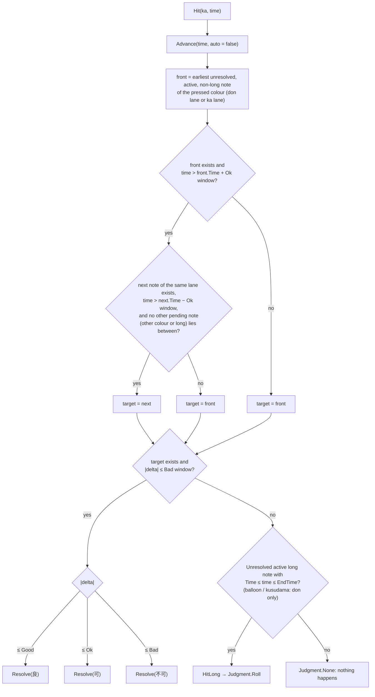
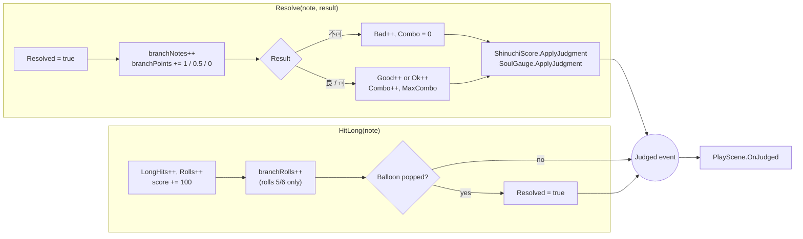

# Judging System

How a drum press becomes a 良／可／不可 or a roll hit in SinglePlayScene. The judge itself is
pure C# in `Assets/OurTaiko/Runtime/Core/PlaySession.cs`, with no dependency on frame rate,
rendering or audio. `Assets/OurTaiko/Runtime/Play/PlayScene.cs` feeds it a song time and the
drum input, and turns its `Judged` events into visuals and sound.

## 1. Pieces and responsibilities

| Piece | Role |
| --- | --- |
| `InputManager` | Collects keyboard, touch and mouse presses with their order inside the frame and publishes `PressesThisFrame` before any scene script runs. |
| `PlayScene.Update` | Computes the song time, advances the session, and passes the **first** drum press of the frame to `Hit`. |
| `PlaySession.Advance` | Moves time forward: auto-play, timeout misses, roll ends, branch decisions and `#SECTION` resets. |
| `PlaySession.Hit` | Judges one press against the front of its colour's lane (don or ka), or counts it as a roll／balloon hit. |
| `PlaySession.Resolve` / `HitLong` | Update counters, combo, branch statistics, Shinuchi score and the soul gauge, then raise `Judged`. |
| `PlayScene.OnJudged` | Judgment sprite, soul gauge display, note arc, balloon counter and pop sound. |

## 2. Per-frame flow

Notes:

- **Input mutex (intentional deviation from OurTaikoPlayer):** only the earliest drum press of a
  frame is judged. Every other press in that frame is dropped: no judgment, no sound, no flash.
  OurTaikoPlayer handled all four drum keys every frame in a fixed order.
- The press is judged at the song time of the frame that processes it, not at the press's own
  timestamp. The press timestamp is used only to order presses within the frame.
- `audioOffsetMs` shifts judging; `visualOffsetMs` shifts only the drawn position.

## 3. Timing windows

The windows are measured from the note time in either direction and taken from the original
simulator (frame-based values in seconds).

| Course | 良 (Good) | 可 (Ok) | 不可 (Bad) |
| --- | --- | --- | --- |
| Easy, Normal | ±41.7 ms | ±108.4 ms | ±125.1 ms |
| Hard, Oni, Edit | ±25.0 ms | ±75.1 ms | ±108.4 ms |

## 4. Advancing time (`Advance`)

`Advance` runs every frame and again at the start of every `Hit`. It first walks the timeline
of branch decisions and `#SECTION` resets that are now due. For each one it advances the notes
up to just before the event, then applies the event. A long frame therefore cannot let later
hits leak into an earlier branch decision.

- A timed-out note gets `Missed`, so it keeps scrolling past the judge instead of disappearing.
  Only a real hit removes a note from the lane.
- Auto-play hits rolls at a fixed **15 per second**. The original's BPM-dependent roll rate is
  not ported.
- A roll or balloon that reaches its end without being completed is resolved silently: no 不可,
  no combo break and no gauge change.

## 5. Judging a press (`Hit`)

Don and ka are **two separate lanes**, as in the original `player.cpp::check_note`
(`don_notes`／`kat_notes`). Big notes share the lane of their colour. A press looks only at its
own lane, so a pending note of the other colour never blocks it.

Key rules:

- **Separate lanes.** Example: don at 0 ms, ka at 62.5 ms. A ka press at 20 ms judges the ka
  (可, 42.5 ms early). A don press at 24 ms then still judges the earlier don (良). The press
  order does not have to follow the chart order across colours.
- **Look-ahead within a lane.** If the front note is already later than the 可 window, a press
  that falls within 可 of the next same-colour note judges that next note. This only happens
  when no other pending note (the other colour, or a roll／balloon) lies between them;
  otherwise the press stays on the front note (usually 不可). The skipped front note is left to
  time out. This copies the original's `blocked_by` check.
- A press outside the window of its lane's target judges nothing. It does not produce 不可 or
  break combo, but it may still count as a roll hit if a roll is under the judge.
- **Big notes need only one hit** (intentional deviation). There is no two-handed window and no
  bonus, and a big note scores like a small one.
- Normal notes take priority: a press that judges a note is never also a roll hit. In the
  original, every press goes to the roll while one is active; that difference is unchanged here.
- Rolls (5／6) accept don and ka. Balloons (7) and kusudama (9) accept **don only**, and resolve
  as soon as `LongHits == BalloonHits` (the balloon is popped).

## 6. What a judgment updates

| Effect | 良 | 可 | 不可 | Roll／balloon hit |
| --- | --- | --- | --- | --- |
| Score (Shinuchi) | base score | base ÷ 2, floored to 10 | 0 | 100 per hit (no 5000 pop bonus) |
| Combo | +1 | +1 | reset | unchanged |
| Soul gauge | + (course／star table) | + (table) | − (table) | unchanged |
| Branch accuracy | 1 | 0.5 | 0 | — |
| Branch roll count | — | — | — | +1 (5／6 only) |
| Note arc to soul badge | yes | yes | no | each roll hit; a balloon only when popped; never for kusudama |

The Shinuchi base score is fixed per chart (see `ShinuchiScore.cs`). Big notes, GOGO and combo
add no multiplier. The soul gauge uses the original `gauge.h` tables. Its clear line is
60／70／80 % for Easy／Normal+Hard／Oni+Edit.

`PlayScene.OnJudged` then:

- refreshes the gauge display for non-roll results;
- plays the hit sound and drum flash for auto-play;
- spawns the note arc;
- shows the 良／可／不可 sprite, or updates the balloon counter (playing the pop sound when the
  balloon pops) or the roll counter;
- refreshes the HUD.

## 7. Branch selection

At each `#BRANCHSTART` decision time, `SelectBranch` computes a value from the statistics
gathered since the last reset:

- **`p` (accuracy):** `floor(branchPoints / branchNotes × 100)`, clamped to 0–100. 良 counts 1,
  可 0.5 and 不可／miss 0.
- **`r` (rolls):** the larger of the roll hits counted since the reset (rolls 5／6 only; balloons
  and kusudama excluded) and the hit count of a roll still running at the decision time.

The route is Master if `value ≥ master`, Expert if `expert ≤ value < master`, and otherwise
Normal. The statistics then reset. Notes on routes that were not chosen are never judged,
scored or drawn: `IsActive` filters them everywhere above.

## 8. Related tests

- `Tests/Finished/EditMode`: `ChartTests.cs` (parsing, windows, misses, separate don／ka lanes, look-ahead), `BranchTests.cs`
  (thresholds and timing), `ShinuchiTests.cs`, `SoulGaugeTests.cs`.
- `Tests/Finished/PlayMode/DrumInputMutexTests.cs`: one judged press per frame.
- `Tests/Finished/PlayMode/SceneFlowTests.cs`, `ScoreGaugeFlowTests.cs`: judging in the real scene.
